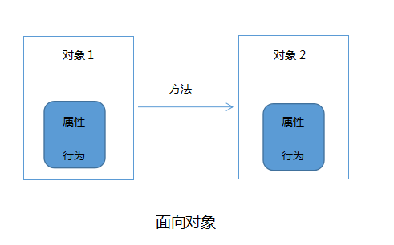
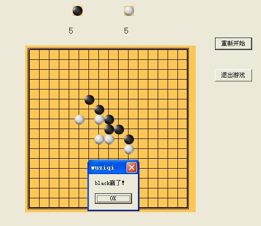

# 面向对象vs面向过程

> 本文转载于 http://kids.codepku.com/article/56

学习编程， 基本功是掌握编程语言，但编程的本质是逻辑，所以编程思维的培养也很重要。面向过程和面向对象是两种重要的编程思想，下面讲述一下这两者的区别和优缺点比较。

## 面向过程

面向过程是一种以事件为中心的编程思想，编程的时候把解决问题的步骤分析出来，然后用函数把这些步骤实现，在一步一步的具体步骤中再按顺序调用函数。


举个例子，下五子棋，面向过程的设计思路是首先分析解决这个问题的步骤：

（1）开始游戏（2）黑子先走（3）绘制画面（4）判断输赢（5）轮到白子（6）绘制画面（7）判断输赢（8）返回步骤（2）（9）输出最后结果。

用函数实现上面一个一个的步骤，然后在下五子棋的主函数里依次调用上面的函数（不同的编程语言有不同的调用方法，我这里写的是直接调用）：
```
下五子棋{
    开始游戏（）；
    黑子先走（）；
    绘制画面（）；
    判断输赢（）；
    轮到白子（）；
    绘制画面（）；
    判断输赢（）；
    返回到 黑子先走（）；
    输出最后结果；
}
```
可见，面向过程始终关注的是怎么一步一步地判断棋局输赢的，通过控制代码，从而实现函数的顺序执行。

## 面向对象
在日常生活或编程中，简单的问题可以用面向过程的思路来解决，直接有效，但是当问题的规模变得更大时，用面向过程的思想是远远不够的。所以慢慢就出现了面向对象的编程思想。世界上有很多人和事物，每一个都可以看做一个对象，而每个对象都有自己的属性和行为，对象与对象之间通过方法来交互。面向对象是一种以“对象”为中心的编程思想，把要解决的问题分解成各个对象，建立对象的目的不是为了完成一个步骤，而是为了描叙某个对象在整个解决问题的步骤中的属性和行为。



在下五子棋的例子中，用面向对象的方法来解决的话，首先将整个五子棋游戏分为三个对象:

1. 黑白双方，这两方的行为是一样的。

2. 棋盘系统，负责绘制画面

3. 规则系统，负责判定犯规、输赢等。

4. 第一类对象（黑白双方）负责接受用户输入，并告知第二类对象（棋盘系统）棋子布局的变化，棋盘系统接收到了棋子的变化，并负责在屏幕上面显示出这种变化，同时利用第三类对象（规则系统）来对棋局进行判定。

可以看出，面向对象是以功能来划分问题，而不是以**步骤**解决。比如绘制画面这个行为，在面向过程中是分散在了多个步骤中的，可能会出现不同的绘制版本，所以要考虑到实际情况进行各种各样的简化。而面向对象的设计中，绘图只可能在棋盘系统这个对象中出现，从而保证了绘图的统一。

 

## 优缺点比较

### 面向过程
**优点：**

>流程化使得编程任务明确，在开发之前基本考虑了实现方式和最终结果，具体步骤清楚，便于节点分析。

>效率高，面向过程强调代码的短小精悍，善于结合数据结构来开发高效率的程序。

**缺点：**

>需要深入的思考，耗费精力，代码重用性低，扩展能力差，后期维护难度比较大。


### 面向对象
**优点:**

>结构清晰，程序是模块化和结构化，更加符合人类的思维方式；

>易扩展，代码重用率高，可继承，可覆盖，可以设计出低耦合的系统；

>易维护，系统低耦合的特点有利于减少程序的后期维护工作量。

**缺点：**

>开销大，当要修改对象内部时，对象的属性不允许外部直接存取，所以要增加许多没有其他意义、只负责读或写的行为。这会为编程工作增加负担，增加运行开销，并且使程序显得臃肿。

>性能低，由于面向更高的逻辑抽象层，使得面向对象在实现的时候，不得不做出性能上面的牺牲，计算时间和空间存储大小都开销很大。




举例说明两者的优缺点，比如在五子棋游戏中增加悔棋的功能。在面向过程中，从输入到显示再到最后判断的整个步骤都要改动，甚至函数的调用顺序也要改动，而在面向对象的设计中，只需在棋盘系统中增加一个回溯的功能就可以了，黑白双方和规则系统的属性和行为都不需改动。这个例子说明了面向对象程序设计中代码间的相关性低（低耦合特性），使得代码很容易被复用和扩展，同时也说明了面向过程的代码重用性低、扩展能力差。